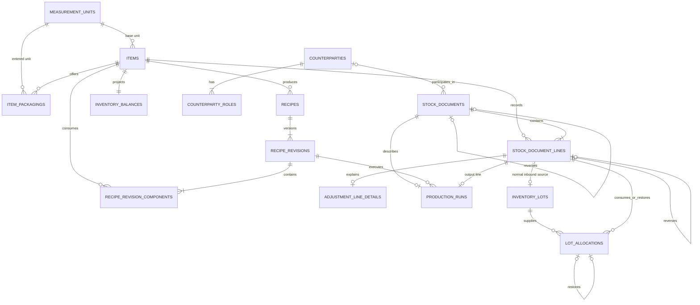

# Target V2 data model

This is the proposed Phase 3 schema contract. Names may receive minor
implementation corrections, but changing a relationship or invariant requires
an ADR update first.

## Infrastructure and settings

### `app_settings`

A singleton containing business name, locale, IANA timezone, currency code,
currency minor digits, and mutable display/planning defaults. Currency becomes
immutable after the first monetary stock document.

### `schema_migrations`

Records migration name, checksum, and application time. It is infrastructure,
not part of the domain ERD.

## Catalog

### `measurement_units`

Controlled unit code and dimension. V2 canonical stock dimensions are mass,
volume, and count. Seeded units are immutable.

### `items`

Unified physical catalog with a canonical base unit; purchasable, producible,
and sellable capabilities; optional SKU, description, default sale price, and
reorder level; timestamps; and `archived_at`.

### `item_packagings`

An item-specific input/display unit such as a 5 kg bag or a box of 12. It stores
an exact rational conversion directly to the item's canonical quantity. There
are no conversion chains.

### `counterparties` and `counterparty_roles`

Shared identity and contact data with one or more `SUPPLIER`/`CUSTOMER` roles.
A counterparty can hold both roles and can be archived without damaging
history.

## Recipes

### `recipes`

Mutable identity containing name, fixed output item, timestamps, and
`archived_at`. The current revision is the highest revision number rather than
a separately mutable pointer.

### `recipe_revisions`

Immutable numbered revision containing standard yield, instructions,
preparation time, optional estimated direct cost, and creation time.

### `recipe_revision_components`

Immutable component quantity and historical unit/conversion snapshot. An item
appears at most once per revision.

## Stock ledger

### `stock_documents`

One immutable posted business action:

- `PURCHASE`, `SALE`, `PRODUCTION`, `ADJUSTMENT`, or `REVERSAL`;
- unique client command/idempotency key;
- monotonic posting sequence;
- optional counterparty;
- business occurrence date and UTC posting instant;
- currency snapshot, notes, and type-specific reason;
- optional unique `reverses_document_id`.

There is no persisted draft or cancelled status in V2.

### `stock_document_lines`

The sole physical and commercial line representation. Each line has an item,
`IN`/`OUT` direction, positive canonical integer quantity, historical entered
unit/conversion snapshot, nonnegative inventory valuation in microcurrency,
optional commercial total in currency minor units, line order, and optional
`reverses_line_id`.

Purchase/sale lines and independently authored inventory movements do not
exist.

### `adjustment_line_details`

Optional one-to-one adjustment metadata. A physical-count line preserves the
expected pre-count quantity and observed quantity whose difference produced the
canonical ledger line.

### `production_runs`

One-to-one production metadata linking a production document to the exact
recipe revision and its single output line. It also records any explicitly
entered direct production cost. Actual inputs and yield remain the canonical
document lines.

## Lots and projections

### `inventory_lots`

One lot for each non-reversal inbound line. It contains the item, source line,
initial quantity, optional supplier/manufacturer code, received/produced date,
and optional inclusive `expires_on` date. Users split an inbound item into
separate document lines when lot identity or expiry differs.

### `lot_allocations`

Allocates an outbound line across one or more same-item lots. Normal entries
consume stock. An exact reversal of an outbound line creates restoration
entries referencing the original allocations. Allocation effects are
immutable, fully cover the associated line, and may never overconsume a lot.

### `inventory_balances`

One rebuildable row per item containing canonical quantity and total inventory
valuation in microcurrency. Average cost is derived and never stored as a
mutable independent value.

## Deliberately absent tables

- No separate ingredient and product tables.
- No purchase-line, sale-line, or inventory-movement duplication.
- No generic item-to-item conversion graph.
- No durable draft table.
- No rounded average-unit-cost column.
- No warehouse/location table in the single-location V2 scope.
