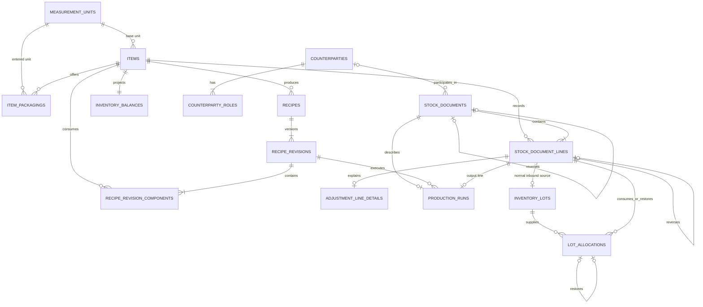

# V2 SQLite data model

This is the Phase 3 schema contract implemented by
`app/database/schemas/0001_v2_baseline.sql`. It is the executable lower-layer
authority for stores and application work. Changing a relationship,
representation, or invariant requires an ADR and a new forward migration
before a dependent layer changes.

The baseline intentionally has no compatibility surface for the seven
experimental migrations. Existing models, repositories, services, and pages
that still describe those tables are legacy code, not an alternate V2 model.

## Infrastructure and settings

All domain tables are `STRICT` and use foreign keys. Domain entities use local
SQLite integer identifiers. Controlled measurement units use their immutable
code, link rows may use a natural composite key, and one-to-one detail rows
reuse their owner's integer key. Storage names expose their representation:

- `_atomic` is an exact `int64` quantity in milligrams, microlitres, or
  thousandths of a count;
- `_minor` is commercial money in the configured currency's minor unit;
- `_micro` is inventory valuation or production cost at one million units per
  whole currency unit;
- `_at_ms` is a UTC Unix millisecond instant;
- `_on` is an ISO `YYYY-MM-DD` business or expiry date.

SQLite `REAL` has no business use in the baseline. Rational conversions store
positive numerator and denominator integers directly to atomic quantity.

### `app_settings`

A singleton containing business name, locale, IANA timezone, currency code,
currency minor digits, and optional hourly labor cost and default margin in
basis points. Initial values are `pt-BR`, `America/Sao_Paulo`, and `BRL` with
two minor digits. Currency becomes immutable after the first stock document,
because every inventory value is denominated in it. Planning values never
silently alter inventory valuation.

### `schema_migrations`

Records the contiguous integer version, exact filename, SHA-256 checksum of the
embedded file, and application time. SQLite `application_id` is `1398228308`
(`SWET`) and `user_version` mirrors the highest applied migration. It is
infrastructure, not part of the domain ERD. The complete startup and authoring
contract is in the [database development guide](../development/database.md).

## Catalog

### `measurement_units`

Controlled unit code, label, dimension, and positive rational conversion to
atomic quantity. V2 canonical stock dimensions are mass, volume, and count.
The baseline seeds `mg`, `g`, `kg`, `ul`, `ml`, `l`, `milli_each`, `each`, and
`dozen`; `g`, `ml`, and `each` are the only item base units. Seeded units are
immutable.

### `items`

Unified physical catalog with a canonical base unit; purchasable, producible,
and sellable capabilities; optional SKU, description, default sale price, and
reorder level; timestamps; and `archived_at`.

Name uniqueness uses a separately stored key produced by Unicode whitespace
trim, NFC normalization, full Unicode case folding, and final NFC
normalization. SQLite enforces that key across active and archived items; the
Go catalog store owns producing it because SQLite `NOCASE` is ASCII-only. An
optional SKU uses the same normalization and remains unique even when its item
is archived.

### `item_packagings`

An item-specific input/display unit such as a 5 kg bag or a box of 12. It stores
an exact rational conversion directly to the item's canonical quantity. There
are no conversion chains. Creating a packaging definition locks the item's base
unit while that packaging is active; a published recipe revision or ledger line
locks it permanently. Archived incompatible packaging must be reconfigured for
the new dimension before it can be restored.

### `counterparties` and `counterparty_roles`

Shared identity and contact data with one or more `SUPPLIER`/`CUSTOMER` roles.
A counterparty stores name, optional phone, email, and notes. It can hold both
roles and can be archived without damaging history. Counterparty names are not
unique.

## Recipes

### `recipes`

Mutable identity containing name, fixed output item, timestamps, and
`archived_at`. The current revision is the highest revision number rather than
a separately mutable pointer.

### `recipe_revisions`

Immutable numbered revision containing standard yield, instructions,
preparation time, optional estimated direct cost in microcurrency, and creation
time.

### `recipe_revision_components`

Immutable component quantity and historical unit/conversion snapshot. An item
appears at most once per revision.

## Stock ledger

### `stock_documents`

One immutable posted business action:

- `PURCHASE`, `SALE`, `PRODUCTION`, `ADJUSTMENT`, or `REVERSAL`;
- unique client command/idempotency key;
- monotonic posting sequence;
- optional counterparty;
- business occurrence date and UTC posting instant;
- currency snapshot, notes, and type-specific reason;
- optional unique `reverses_document_id`.

There is no persisted draft or cancelled status in V2.

The document stores a separate positive, unique `posting_sequence`. It must be
strictly greater than the current maximum; gaps are allowed. Allowed reasons
are deliberately closed:

- purchase: no reason or `FREE_STOCK`;
- sale: no reason, `PROMOTION`, or `SAMPLE`;
- production: no reason;
- adjustment: `OPENING_BALANCE`, `PHYSICAL_COUNT`, `WASTE`, `EXPIRY`,
  `DAMAGE`, `SAMPLE`, `DOCUMENTED_CORRECTION`, or `FREE_STOCK`;
- reversal: `EXACT_REVERSAL`.

### `stock_document_lines`

The sole physical and commercial line representation. Each line has an item,
`IN`/`OUT` direction, positive canonical integer quantity, historical entered
unit/conversion snapshot, nonnegative inventory valuation in microcurrency,
optional commercial total in currency minor units, line order, and optional
`reverses_line_id`.

Purchase/sale lines and independently authored inventory movements do not
exist.

### `adjustment_line_details`

Optional one-to-one adjustment metadata. A physical-count line preserves the
expected pre-count quantity and observed quantity whose difference produced the
canonical ledger line.

### `production_runs`

One-to-one production metadata linking a production document to the exact
recipe revision and its single output line. It also records any explicitly
entered direct production cost in microcurrency. Actual inputs and yield
remain the canonical document lines.

## Lots and projections

### `inventory_lots`

One lot for each non-reversal inbound line. It contains the item, source line,
initial quantity, optional supplier/manufacturer code, generic origin date,
and optional inclusive `expires_on` date. An expiry may precede the origin date
so an already-expired lot discovered by a physical count is representable.
Users split an inbound item into separate document lines when lot identity or
expiry differs.

### `lot_allocations`

Allocates an outbound line across one or more same-item lots. Normal entries
consume stock. An exact reversal of an outbound line creates restoration
entries referencing the original allocations. Allocation effects are
immutable, fully cover the associated line, and may never overconsume a lot.

### `inventory_balances`

One rebuildable row per item containing canonical quantity and total inventory
valuation in microcurrency. Average cost is derived and never stored as a
mutable independent value.

## Enforcement boundary

The baseline rejects structurally invalid rows even outside the application.
SQLite owns strict types, checks, foreign keys, uniqueness, allowed row shapes,
immutable history, linked reversal/allocation structure, and nonnegative
projection limits.

Validity that depends on a complete command or an ordering algorithm belongs to
one explicit Go transaction. That includes document and revision completeness,
idempotent retry behavior, checked conversion and arithmetic, valuation,
same-item reconciliation, full lot coverage, FEFO and expiry eligibility,
projection updates, and ledger replay. A store must not expose unrestricted
CRUD for ledger tables or `inventory_balances`.

## Deliberately absent tables

- No separate ingredient and product tables.
- No purchase-line, sale-line, or inventory-movement duplication.
- No generic item-to-item conversion graph.
- No durable draft table.
- No rounded average-unit-cost column.
- No warehouse/location table in the single-location V2 scope.
